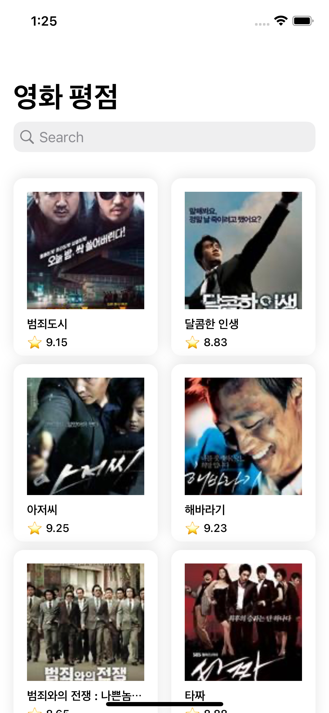
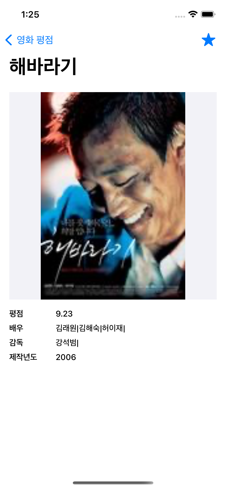

# MoviewReview

네이버 검색 API를 사용하여 영화를 검색하고 즐겨찾기 기능을 적용한 샘플입니다.  

- UI작업은 [Snapkit](https://github.com/SnapKit/SnapKit) 을 사용하였습니다.
- MVP패턴을 사용하여 코드를 작성하였습니다. 
- BDD를 따르는 UI Test, Unit Test 코드를 작성하였습니다. 

